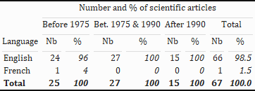
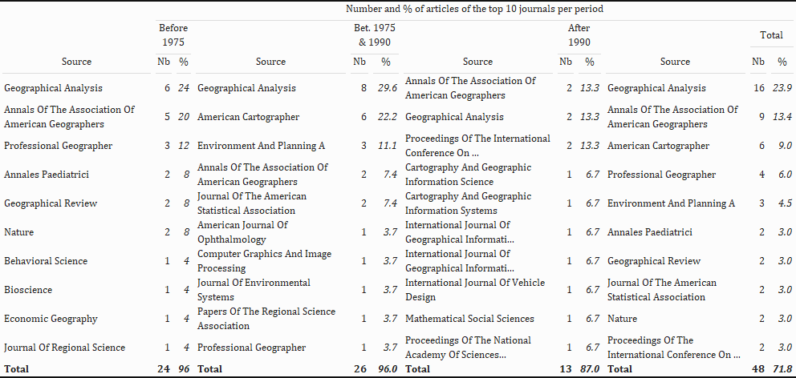

```{r setup, include = FALSE}
knitr::opts_chunk$set(echo = TRUE)

# webshot::install_phantomjs()
```

# Analyse du corpus de publications de Waldo R. Tobler

Sources : bases de données Web of Science, Google Scholar, Scopus, Base, et ISTEX

Approche géographique des sciences :
URL : https://geoscimo.univ-tlse2.fr

# Chargement des bibliotheques

```{r warning = F, error = F, message = F, comment = NA}

library(tidyverse) # famille de packages de traitement de données
library(cowplot) # fonctions complémentaires au package ggplot2 pour la mise en forme de graphiques
library(ggthemes) # thèmes graphiques pour ggplot2
library(kableExtra) # package permettant de mettre en forme des tableaux au format image
library(magick) # package nécessaire au bon fonctionnement de kableExtra
library(jsonlite) # package permettant de manipuler des données au format json

```


# Aménager son espace de travail

La ligne suivante permet de créer des dossiers dans le répertoire de travail qui seront utiles pour ranger les différents éléments de travail (données d'un côté, exports graphiques de l'autre).

```{r warning = F, error = F, message = F, comment = NA, results = FALSE}

map(c("data", "figures"), dir.create) # créer deux nouveaux dossiers dans le répertoire

dir.create("data/wos")

```
# Partie 1 : Analyse des données extraites du Corpus WoS

Télécharger les données du corpus WOS, les dezipper dans un nouveau dossier, puis supprimer le zip.


# Analyse du Corpus WOS

## Evolution annuelle de la production scientifique sur Ectocarpus

Il arrive que l'année de publication ne soit pas précisée dans la base de données (information manquante). Commençons par voir s'il y a des années manquantes et si oui, rechercher et compléter l'information manquante.

```{r warning = F, error = F, message = F, comment = NA}
# Repérer les publications pour lesquelles l'année de publication n'est pas précisée (NA)

d <- read_tsv("data/wos/savedrecs_without_WE.txt") %>%
  drop_na(PY)

d %>% 
  select(PY, UT) %>% # sélectionner les colonnes contenant l'identifiant unique des articles et leur année
  filter(is.na(PY)) # sélectionner les lignes pour lesquelles l'année est marquée comme manquante ("NA")

```

Après vérification, on observe que toutes les publications sont datées


```{r warning = F, error = F, message = F, comment = NA}

# Compter et stocker le volume de publication par an en vue d'une représentation graphique

time <- d %>% # créer un objet "time" dans lequel on place le résultat du comptage
  group_by(PY) %>% # grouper l'information de la base de données au niveau des années (colonne "PY")
  summarise(n = n()) %>% # créer un nouveau tableau avec une colonne indiquant le nombre total d'articles/an
  arrange(PY) # ordonner le tableau obtenu dans l'ordre croissant des années 

```

Générer un graphique représentant l'évolution annuelle du nombre d'articles.

```{r warning = F, error = F, message = F, comment = NA}

# Représenter l'évolution annuelle du nombre d'articles scientifiques portant sur Ectocarpus

color <- c("#CC9900") # choix d'une couleur (code couleur RVB en hexadécimal ou nom de couleur)
  

#min <- min(as.Date(d$PY, format = "%Y")) # borne minimale de la distribution annuelle
#max <- max(as.Date(d$PY, format = "%Y")) # borne maximale la distribution annuelle

plot_fig1 <- ggplot(time, aes(x = PY, y = n)) + # représenter "PY" en x et "n" en y # as.Date(PY, format = "%Y", origin  # = '1956-01-01')
  geom_line(aes(color = color)) + # tracer une ligne de la couleur choisie précédemment
  geom_point(aes(color = color)) + # tracer des points de la couleur choisie précédemment
  theme_light() + # choisir un thème graphique
  xlab("Publication years") + ylab("Number of publications") + # titre des axes
 # scale_x_date(limits = c(min, max), # borne min et max de l'axe des abscisses
             #  expand = c(0, 80), # permet de ne pas étendre l'axe au delà des bornes min et max
              # breaks = seq(min, max, by = "4 years"), # régularité des étiquettes de l'axe (tous les 4 ans)
               # labels = scales::date_format("%Y")) + # format de l'étiquette de l'axe (l'année uniquement)
  ggtitle("Annual number of scientific publications by Waldo R. Tobler") + # titre du graphique
  scale_color_manual(values = color, labels = c("Waldo R. Tobler research")) + # légende et texte de la légende
  theme(plot.title = element_text(size = 11), # taille du titre
        axis.text.x = element_text(angle = 40), # angle d'inclinaison des étiquettes de l'axe des abscisses
        panel.grid.major.x = element_blank(), # quadrillage léger
        legend.position = "bottom", # position de la légende
        legend.background = element_rect(fill = NA), # formattage du fond de la légende 
        legend.title = element_blank()) # choisir de ne pas titre la légende

# Exporter la figure au format vectoriel en ajoutant les détails concernant la source

# svg(paste("figures/PY_Tobler.svg"), width = 8, height = 4) # export en vectoriel, taille de l'image

# plot.new() # ouvrir la fenêtre graphique

ggdraw(add_sub(plot_fig1, # représenter la figure stockée dans l'objet "plot_fig1"
               # y ajouter une clef de lecture :
               fontface = "italic", fontfamily = "sans", # fonte du texte à ajouter
               size = 8, # taille du texte à ajouter
               color = "black", # couleur du texte à ajouter
               x = 0, y = 0.5, # position du texte à ajouter
               hjust = 0, vjust = 0.5, lineheight = 1, # position du texte à ajouter
               label = # contenu du texte à ajouter
                 "Web of Science Core Collection.\nQuery: 1163649 (Author Record Id) or 3113353 (Author Record Id) or 1429105 (Author Record Id)\nand Tobler WE (Exclude – Authors)"
               ))
# dev.off() # sortir de la fenêtre graphique

```

## Périodisation du corpus en 3 périodes

Sur la base de la courbe précédente, on choisit une périodisation en 3 périodes. 

```{r warning = F, error = F, message = F, comment = NA}

# périodiser en 3 périodes

d <- d %>%
  # ajouter une nouvelle colonne nommée "time"
  mutate(time = 
           ifelse(as.numeric(PY) < 1975, # pour les articles dont l'année de publication est inf. à 1991
                  "p1", # le contenu de la colonne "p1"
                       ifelse(as.numeric(PY) >= 1975 & as.numeric(PY) < 1990, # pour les articles entre 91 et 2001
                              "p2", # le contenu de la colonne sera "p2"
                              "p3"))) # sinon, ce sera "p3"

```

## Langues des articles aux différentes périodes

On s'intéresse maintenant à la question de la langue d'écriture des articles. On voit que l'anglais est devenu de plus en plus majoritaire au fil du temps, ce qui est cohérent avec le fait que la base de données indexe préférentiellement des revues en langue anglaise. Cela témoigne aussi du fait que les scientifiques en biomédecine ont pris l'habitude de publier leurs résultats en anglais.

```{r warning = F, error = F, message = F, comment = NA}


# sélectionner la variable "langue de publication", puis mesurer le nombre ainsi que le pourcentage d'articles par langue et par période

tab_1 <- d %>% 
  group_by(time, LA) %>%  # grouper les données par période et par langue de publication
  # créer un nouveau tableau indiquant le nombre d'articles par période et par langue
  summarise(n = n()) %>% 
  mutate(prct = round(n/sum(n)*100, 1)) %>% # ajouter une colonne avec le % d'articles par langue à chaque période
  pivot_wider(names_from = time, values_from = c(n, prct)) %>% # transposer le tableau en largeur
  mutate(across(everything(), ~replace_na(.x, 0))) %>% # remplacer les valeurs manquantes par des zeros
  mutate(total_nb = rowSums(across(starts_with("n")))) %>% # ajouter une colonne avec le total des 3 périodes
  mutate(total_prct = round(total_nb/sum(total_nb)*100, 1)) %>% # ajouter une colonne avec le % du total
  relocate(prct_p1, .before = 3) %>% # modifier la position de la colonne prct_p1
  relocate(prct_p2, .before = 5) # modifier la position de la colonne prct_p2

```


Ce qui précède permet d'obtenir un tableau de l'évolution de la langue de publication des articles du corpus au cours du temps. Dans ce qui suit, on utilise les fonctions du package {KableExtra} pour mettre en forme et exporter le tableau  obtenu au format image.

```{r warning = F, error = F, message = F, comment = NA}

tab_1 %>%
  bind_rows(summarise(., # ajouter les totaux par colonne
                      across(where(is.numeric), sum), # faire le total pour les colonnes numériques
                      across(where(is.character), ~"Total")) %>% # écrire "Total" dans la première colonne
              mutate(across(starts_with("prct_"), round, 0))) %>%  # arrondir les nombres obtenus pour les %
  kbl(col.names = NULL) %>% # représenter le contenu du tableau sauf les entêtes de colonnes
  # ajouter une première entête de colonne pour chacune des 9 colonnes du tableau
  add_header_above(c("Language", rep(c("Nb", "%"), 4))) %>%
  # ajouter une seconde entête surplombant la première, indiquant les 3 périodes et la partie Total
  add_header_above(c(" ", "Before 1975" = 2, "Bet. 1975 & 1990" = 2, "After 1990" = 2, "Total" = 2)) %>%
  # ajouter une troisième entête générale précisant le contenu d'ensemble du tableau
  add_header_above(c(" ", "Number and % of scientific articles" = 8)) %>%
  kable_classic(full_width = F, html_font = "Cambria") %>% # choisir l'apparence du tableau et la police
  row_spec(dim(tab_1)[1]+1, bold = T)  %>%  # mettre en gras la dernière ligne (totaux en ligne)
  column_spec(c(3, 5, 7, 9), italic = T)  %>% # mettre en italique les colonnes contenant les %
  save_kable(paste("figures/lang_de_publi.png")) # exporter et sauvegarder la figure au format image

 # afficher la figure sauvegardée

```

## Principales revues aux différentes périodes

Regardons à présent l'évolution du paysage éditorial. Quelles sont les principales revues scientifiques dans lesquelles les articles portant sur l'organisme modèle sont publiés ? On reprend la périodisation en 3 périodes et l'on regarde le top 10 des revues à chaque période.

```{r warning = F, error = F, message = F, comment = NA}

tab_2 <- d %>%
  group_by(time, SO) %>% # grouper les données par période et par source (nom de revues)
  # créer un nouveau tableau indiquant le nombre d'articles par période et par source
  summarise(n = n()) %>% #
  mutate(prct = round(n/sum(n)*100, 1)) %>% # ajouter une colonne avec le % d'articles par revue à chaque période
  # ranger le tableau dans l'ordre décroissant du nombre d'articles par revue, le tout pour chaque période
  arrange(desc(n), .by_group = TRUE) %>%
  # ne garder que les premières revues de chaque période
  slice_max(n, n = 10, with_ties = F) %>%
  split(list(.$time)) %>% # séparer le résultat en 3 tableaux distincts
  bind_cols %>% # recoller les 3 tableaux en largeur
  # ajouter le top 10 des revues de l'ensemble du corpus et la répartition en % 
  bind_cols(d %>%
              group_by(SO) %>% # grouper les données par source (nom des revues)
              summarise(total_nb = n(), # nombre d'articles par source
                        total_prct = (round(n() / nrow(.) * 100, 1))) %>% # % d'articles par source
              arrange(desc(total_nb)) %>% # ordre décroissant du nombre d'article
              slice_max(total_nb, n = 10, with_ties = F)) %>% # top 10 uniquement
  rename_with(~ tolower(gsub("...", "_", .x, fixed = TRUE)), contains("...")) %>% # modifier les noms de colonnes
  # tronquer les titres de revues (ne garder que les 50 premiers caractères) et passer en minuscule
  mutate(across(where(is.character), str_to_title), # passer en minuscule
         across(where(is.character), str_trunc, 50)) %>% # tronquer
  select(-contains("time")) # supprimer la colonne "time"


```

Dans ce qui suit, on utilise les fonctions du package KableExtra pour mettre en forme et exporter le tableau obtenu au format image.

```{r warning = F, error = F, message = F, comment = NA}

tab_2 %>% 
  bind_rows(summarise(., # ajouter les totaux par colonne
                      across(where(is.numeric), sum), # faire le total pour les colonnes numériques
                      across(where(is.character), ~"Total")) %>% # écrire "Total" dans la première colonne
              mutate(across(starts_with("prct_"), round, 0))) %>% # arrondir les nombres obtenus pour les %
  kbl(col.names = NULL) %>% # représenter le contenu du tableau sauf les entêtes de colonnes
  # ajouter une première entête de colonne pour chacune des 12 colonnes du tableau
  add_header_above(c(rep(c("Source", "Nb", "%"), 4))) %>%
  # ajouter une seconde entête surplombant la première, indiquant les 3 périodes et la partie Total
  add_header_above(c(" ", "Before 1975" = 2, " ", "Bet. 1975 & 1990" = 2, " ", "After 1990" = 2, " ", "Total" = 2)) %>%
  #  ajouter une troisième entête générale précisant le contenu d'ensemble du tableau
  add_header_above(c(" ", "Number and % of articles of the top 10 journals per period" = 11)) %>%
  kable_classic(full_width = F, html_font = "Cambria") %>% # choisir l'apparence du tableau et la police
  row_spec(dim(tab_2)[1]+1, bold = T)  %>%  # mettre en gras la dernière ligne (totaux en ligne)
  column_spec(c(3, 6, 9, 12), italic = T)  %>% # mettre en italique les colonnes contenant les %
   save_kable(paste("figures/journals.png")) # exporter et sauvegarder la figure au format image

  # afficher la figure sauvegardée

```

## L'évolution des domaines et spécialités scientifiques

La variété des titres de revues suggère que les articles relèvent de différents domaines. Pour y voir plus clair, on peut s'intéresser à la variable de la base de données indiquant le domaine scientifique des revues du Web of Science. Il s'agit de la variable "WC" pour "Web of Science Category". Il s'agit d'une catégorisation en 262 sous-catégories disciplinaires. Certaines revues sont rattachées à plusieurs catégories. Pour le comptage, on tient compte de toutes les catégories. Pour les articles parus dans des revues multicatégories, on procède à un fractionnement. Pour un article donné, on affecte une fraction d'article à chaque catégorie auquel se rattache la revue dans lequel il a été publié.

```{r warning = F, error = F, message = F, comment = NA}

tab_3 <- d %>%
  # sélectionner l'id. unique des articles, la catégorie disciplinaire des revues, et leur année de publication
  select(UT, WC, PY) %>% 
  # séparer sur plusieurs lignes les cas de revues multicatégories (catégories séparées par un ";")
  separate_rows(WC, sep = "; ", convert = TRUE) %>% 
  group_by(UT) %>% # grouper le tableau obtenu par article
  # ajouter une nouvelle colonne indiquant la fraction d'articles attribuée à chaque catégorie
  mutate(count = 1/n()) %>% 
  ungroup() # dégrouper

# sélectionner les 5 catégories auxquelles sont associées le plus d'articles (en nombre fractionné)

var <- tab_3 %>%
  group_by(WC) %>% # grouper les données du tableau 3 par catégorie disciplinaire
  summarise(nb_pub = sum(count)) %>% # compter le nombre fractionné d'articles de chaque catégorie
  arrange(-nb_pub) %>% # ranger le tableau dans l'ordre décroissant de ce nombre
  select(WC) %>% # conserver uniquement les catégories
  slice(1:3) %>% # ne retenir que les 3 premières
  pull() # transformer le résultat en vecteur


```

Représentons sur une même figure l'évolution annuelle des articles pour chacune des trois principales catégories disciplinaires. Cela revient à reprendre le script de la première figure en ajoutant une distinction par catégorie qui aboutit au traçage de plusieurs droites : une par catégorie.

```{r warning = F, error = F, message = F, comment = NA}

# Préparer les données qui seront utilisées pour la représentation

fig2 <- tab_3 %>% 
  filter(WC %in% var) %>% # ne conserver que catégories disciplinaires du top 5 (contenu du vecteur var)
  group_by(WC, PY) %>% # grouper les données par catégorie et année de publication
  summarise(n = sum(count)) # compter le nombre fractionné d'articles de chaque catégorie par année


plot_fig2 <- ggplot(fig2, # représenter "PY" en x, "n" en y, et la variable de groupe "catégorie disciplinaire"
                    aes(x = PY, y = n, group = WC)) + # as.Date(PY, format = "%Y")
  geom_line(aes(color = WC), # faire varier la couleur des droites selon la catégorie
            lwd = 0.7) + # régler l'épaisseur des droites
  geom_point(aes(color = WC)) + # faire varier la couleur des points selon la catégorie
  theme_bw()+ # choisir un thème graphique
  xlab("Publication year") + ylab("Number of publications") + # titre des axes
  #scale_x_date(limits = c(min, max), expand = c(0, 80), # limites temporelles de l'axe des abscisses
              # breaks = seq(min, max, by = "4 years"), # régularité des étiquettes de l'axe (tous les 4 ans)
              # labels = scales::date_format("%Y")) + # format de l'étiquette de l'axe
  ggtitle("Annual number of publications per speciality") + # titre du graphique
  ggthemes::scale_colour_gdocs() + # choix d'une palette de couleur pour les catégories
  guides(fill = guide_legend(ncol = 3)) +  # choisir de formatter la légende sur 3 colonnes
  theme(plot.title = element_text(size = 11), # taille du titre
        axis.text.x = element_text(angle = 30), # angle d'inclinaison des étiquettes de l'axe x
        legend.position = "bottom", # position de la légende
        legend.background = element_rect(fill = NA), # formattage du fond de la légende
        legend.title = element_blank() # choisir de ne pas titrer la légende
  )  


# Exporter la figure au format vectoriel en ajoutant les détails concernant la source


# svg(paste("figures/Annual_nb_of_pub_per_spec.svg"), 
   #  width = 7.5, height = 6) # export en vectoriel, taille de l'image

# plot.new() # ouvrir la fenêtre graphique

# ajouter un élément de texte en dessous du graphique

ggdraw(add_sub(plot_fig2, 
               fontface = "italic", fontfamily = "sans", size = 8, color = "black", 
               x = 0, y = 0.5, hjust = 0, vjust = 0.5,  lineheight = 1,
               label =
                 "Top 3 specialities of the corpus. Web of Science Core Collection."
               ))

# dev.off() # sortir de la fenêtre graphique


```

## Représenter le réseau interurbain des collaborations scientifiques

En important le corpus WOS Ectocarpus dans l'application web NETSCITY, on obtient des statistiques générales et des cartes, mais aussi une table contenant l'ensemble des résultats du géocodage, et précisant pour chaque affiliation associée aux articles du corpus, sa localisation au niveau municipal, son agglomération urbaine (périmètre des agglomérations définies dans le cadre des projets Géoscience et Netscience), et son pays.

Ce qui suit s'appuie sur le contenu de table adresse exportée depuis NETSCITY et sauvegardée dans le dossier data du répertoire de travail.

Le package {cartigraph} présenté ici est actuellement en cours de développement.

```{r warning = F, error = F, message = F, comment = NA}

# installer et charger le package cartigraph

# install.packages("cartigraph_0.0.0.9000.tar.gz", repos = NULL, type = "source")


library(cartigraph) # le chargement requiert que d'autres packages soient préinstallés et chargés
# voici la liste des dépendences actuelles du package cartigraph
library(igraph) # package généraliste en analyse de réseaux
library(tnet) # package d'analyse des réseaux two-mode et des réseaux pondérés
library(cartography) # package de cartographie thématique
library(usethis) # package associé au développement de nouveaux packages R

# charger la table adresse exportée de NETSCITY

a <- read_delim("data/wos/netscity_tobler.csv", delim = ";") %>%
  # passer les agglomérations en minuscule et tronquer les noms d'agglomérations trop longs
  mutate(agglomeration = str_to_title(str_trunc(agglomeration, 10))) 

# Passer d'une liste de liens entre deux types d'entités (publications - villes) à un réseau pondéré de relations entre villes. L'opération revient à passer d'un graphe two-mode à un graphe one-mode en appliquant un moyen de pondération. Ici la méthode par défaut est une méthode permettant de fractionné la valeur des relations pour un article donné par le nombre de villes total impliquées dans la publication de cet article.

g <- netproj(d = a, e = identifier, p = agglomeration)

# L'opération suivante permet de filtrer les liens pour ne conserver que les liens dont l'intensité est la plus forte. On stocke le sous-graphe ainsi obtenu dans un nouvel objet.

# gtop <- filtedge(g, param = 60) # ce paramètre indique que l'on souhaite conserver 40 % des liens (100-40 = 60)

# Un message apparaît qui indique qu'en valeur, l'ensemble de ces liens représente 91.16% des échanges.

```
```{r warning = F, error = F, message = F, comment = F}

# Représenter le sous-graphe obtenu

# svg(paste("figures/Collab_tobler.svg"), width = 8, height = 6)

cartigraph(g, 
           col.nodes = "#3465A4", # couleur des sommets
           values.rnd.links = 1, # nombre de décimales de la légende des liens
           legend.title.nodes = "Nb of collab. per city\n", # titre de la légende des sommets
           legend.title.links = "Normalised nb of collaboration", # titre de la légende des liens
           # titre du graphe
           title = "Scientific network of interurban collaboration",
           # source du graphe
           source = "Graph of the collaborations indexed in the WoS (SCI-Expanded, CPCI-S, ESCI)",
           author = "MM, 2021", # auteur du graphe
           col.frame = "#3465A4") # couleur du cadre
          
# dev.off()


```


